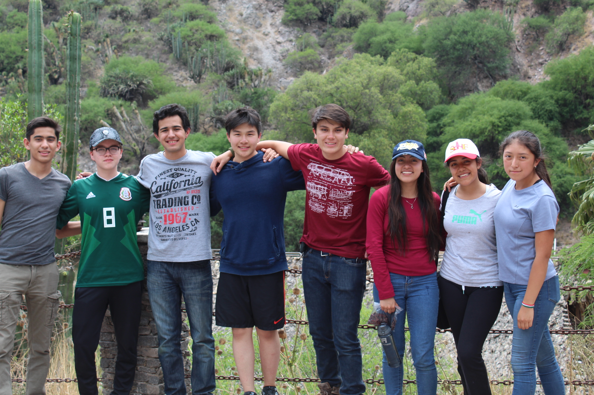

# **Happy Cactus**
### **Group 4 project**

**Description**

The group 4 project is an interdisciplinary activity in which all Diploma Programme science students must participate. The intention is that students from the different group 4 subjects analyse a common topic or problem. The exercise should be a collaborative experience where the emphasis is on the processes involved in, rather than the products of, such an activity.

**Project summary**

Happy Cactus is a progressive web app created as a culmination of the 4 STEM subjects of the team for the IB. Chemistry, physics, biology and computer science. The app has different sections for the analysis of bacteria, infections and plagues on the cactae plantations on the central region of Mexico. The goal of the project is to work as a tool for farmers in order to preserve the fauna an flora of the region.

## **Technologies**
- Html5
- Javascript
- JQuery
- CSS

## **App developers**
- Zhongli He Wen
- Juan Carlos Garfias

## **Team**
- Juan Carlos Garfias Tovar
- Mildred Martínez García
- Zhongli He Wen
- Ana Paula Camacho Pérez
- Mateo Triana Cifuentes
- Javier Castro Solís
- Ángela Pérez
- Ana Cecilia Chacón Parra

